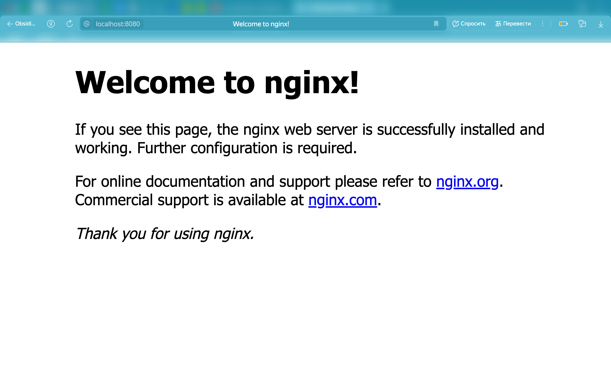
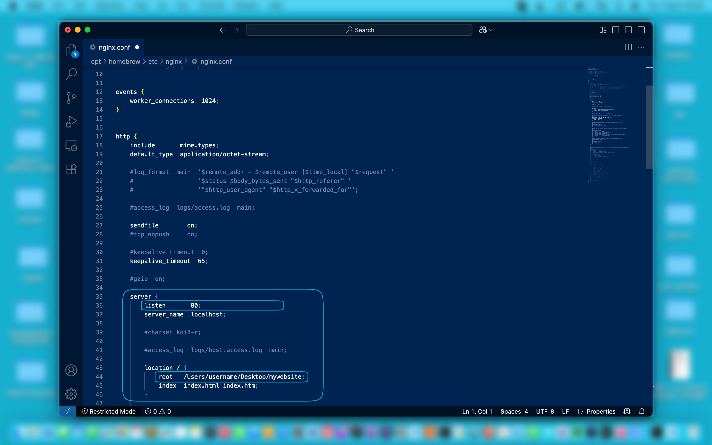
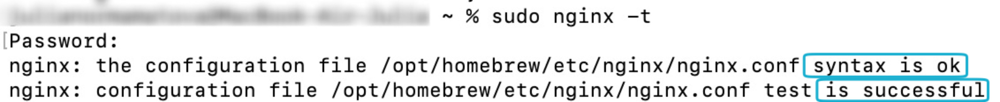
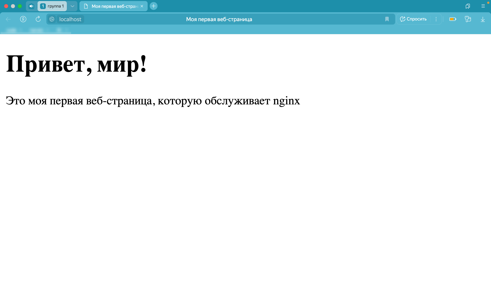

# nginx — безопасная установка, настройка и запуск веб-страницы на macOS 13

Инструкция описывает безопасную установку и настройку веб-сервера **nginx** и запуска на нем веб-страницы с помощью менеджера пакетов **Homebrew** на системе **macOS 13.3** (Ventura) для локального тестирования. Инструкция предназначена для начинающих пользователей, которые изучают веб-технологии и хотят ознакомиться с **nginx**. 

# Ограничение ответственности (disclaimer)

Автор не несет ответственность за возможные неисправности системы, потерю данных и некорректную работу сервиса. Рекомендуется создать резервную копию перед началом работы. Не рекомендуется использовать в production-среде без консультации системного администратора.

# Предварительные требования

Перед началом работы рекомендуется ознакомиться с документацией **nginx**:
- [Официальная документация](https://nginx.org/en/docs/)
- [Руководство для начинающих](https://nginx.org/ru/docs/beginners_guide.html)
- [Руководство администратора](https://docs.nginx.com/nginx/admin-guide/)

С официальной документацией:
- [Homebrew](https://docs.brew.sh/)

# Системные требования

*Таблица 1. Аппаратные требования*

| Компонент        | Минимальные требования            | Рекомендуемые требования |
| ---------------- | --------------------------------- | ------------------------ |
| **Процессор**    | Intel Core i3 (64-бит)            | Apple M1/M2              |
| **Память (RAM)** | 2 ГБ                              | 8 ГБ                     |
| **Память (SSD)** | 50 МБ свободного места            | 1 ГБ свободного места    |
| **Сеть**         | Интернет для загрузки компонентов | Стабильное подключение   |


*Таблица 2. Программные требования*

| Компонент    | Версия                     |
| ------------ | -------------------------- |
| **macOS**    | 10.15 (Catalina) или новее |
| **Homebrew** | 3.0.0 или новее            |

# 1. Подготовка системы
## 1.1. Установка Homebrew (если не предустановлен)

**Homebrew** — утилита командной строки для установки пакетов и приложений. 

Для установки **Homebrew**:

1. Открыть **Терминал** и вставить команду c официального сайта [brew.sh](https://brew.sh/ru/)

```
/bin/bash -c "$(curl -fsSL https://raw.githubusercontent.com/Homebrew/install/HEAD/install.sh)"
```

2. Ввести пароль администратора для подтверждения (ввод пароля *не* отображается).

> [!warning]  
> Во время установки **Homebrew** запрашивается пароль администратора (sudo), так как требуются права (root) для установки в системные директории. Вводить пароль администратора следует только при уверенности в источнике скрипта.

3. Нажать **Return** и дождаться завершения установки (может занять несколько минут). Появится строка **Installation successful**!

4. Убедиться в корректности установки через команду проверки версии:

```
brew --version
```

# 2. Установка nginx

**nginx** (engine x) — высокопроизводительный веб-сервер с открытым исходным кодом, который часто используется для обслуживания статических веб-страниц.

Чтобы установить **nginx** с помощью **Homebrew**:

1. Открыть **Терминал** и ввести команду:

```
brew install nginx
```

2. Дождаться завершения. **Homebrew** автоматически установит все зависимости.

3. Запустить сервер:

```
brew services start nginx
```

4. Проверить статус (должно быть `started`):

```
brew services list
```

5. Для проверки работоспособности перейти по адресу в браузере — http://localhost:8080/


*Рисунок 1. Проверка работоспособности nginx*

> [!note]  
> Порт `8080` используется по умолчанию для избежания конфликтов с другими сервисами.

# 3. Настройка nginx

## 3.1. Создание рабочей директории

Для создания рабочей директории:
1. Создать корневую папку для файлов сайта на рабочем столе (например, mywebsite). 

## 3.2. Поиск конфигурационного файла

Чтобы найти точный путь к конфигурационному файлу **nginx**, выполнить команду:

```
brew info nginx
```

>[!note]
>Обычно конфигурационный файл находится по следующему пути: `/opt/homebrew/etc/nginx/nginx.conf`. 
>Но путь может отличаться в зависимости от конфигурации **Homebrew**.

## 3.3. Редактирование конфигурации

Чтобы указать **nginx**, где искать файлы для сайта:

1. Убедиться, что есть права на редактирование конфигурации проверкой пользователя:

```
whoami
```

>[!important]
> Порт 80 требует прав `sudo`.

2. Открыть конфигурационный файл с помощью текстового редактора (например, **VS Code**):

```
sudo code /opt/homebrew/etc/nginx/nginx.conf
```

3. После ввода пароля откроется файл для редактирования.

4. Внутри блока `server {`  отредактировать строки:

   - `listen` —  `8080` → `80` (указывает nginx слушать входящие соединения на стандартном порту 80 для HTTP).
   - `root` —  `html` → `/User/username/Desktop/mywebsite` (указывает корневую директорию веб-страницы, где nginx будет искать файлы).


*Рисунок 2. Настройка виртуального хоста*

5. Проверить синтаксис конфигурационного файла **nginx.conf** командой:

```
sudo nginx -t
```


*Рисунок 3. Проверка синтаксиса nginx.conf*

# 4. Создание HTML-файла

Чтобы создать HTML-файл для главной страницы сайта, которую будет отображать **nginx**:

1. Открыть текстовый редактор и создать новый файл.

2. Вставить базовый HTML-код в содержимое файла:

```
<!DOCTYPE html>
<html>
<head>
    <meta charset="UTF-8">
    <title>Моя первая веб-страница</title>
</head>
<body>
    <h1>Привет, мир!</h1>
    <p>Это моя первая веб-страница, которую обслуживает nginx!</p>
</body>
</html>
```

3. Сохранить как **index.html** с расширением HTML.

4. В корневой папке **mywebsite** проверить наличие файла **index.html**.

# 5. Просмотр веб-страницы

Для просмотра веб-страницы:
1. Открыть браузер и перейти по адресу — http://localhost


*Рисунок 4. Успешный просмотр веб-страницы в браузере*

# 6. Устранение неполадок (Troubleshooting)

## 6.1. Не запускается nginx

**Проблема**: 

- Команда `brew services start nginx` завершается ошибкой
- При переходе на `http://localhost` страница не загружается

**Решение**:

1. Проверить статус **nginx**:

```
brew services list
```

2. Если статус не `started`, выполнить:

```
brew services restart nginx
```

## 6.2. Ошибки в конфигурации

**Проблема**: 

- После `sudo nginx -t` появляются сообщения о синтаксических ошибках.
- **nginx** перестает отвечать после `reload`

**Решение**:

1. Проверить синтаксис командой:

```
sudo nginx -t
```

2. Если ошибка указывает на строку (например, `line 25`), открыть конфиг:

```
sudo code /opt/homebrew/etc/nginx/nginx.conf
```

3. Убедиться, что все `{ }` и `;` на месте.

4. Проверить корректность пути (например, `/Users/username/Desktop/mywebsite`).

5. Восстановить рабочую версию конфига из резервной копии:

```
sudo cp /opt/homebrew/etc/nginx/nginx.conf.backup /opt/homebrew/etc/nginx/nginx.conf
```

## 6.3. Страница отображается некорректно

**Проблема:**

- В браузере отображаются символы вместо текста.

**Решение:**

1. Проверить кодировку HTML-файла:
    - Открыть `index.html` в **VS Code**
    - В правом нижнем углу кликнуть на кодировку (должно быть: **UTF-8**).
    - Если указана другая, то нажать **Save with Encoding** → **UTF-8**.

2. Проверить наличие мета-тега **<mеta charset="UTF-8">** в **<hеad>**.

# 7. Управление системой
## 7.1. Полезные команды

Ниже представлены базовые команды **nginx**:

*Таблица 3. Управление сервером*

| Команда                       | Описание                                                 |
| ----------------------------- | -------------------------------------------------------- |
| `sudo nginx`                  | Запустить nginx (если не работает через `brew services`) |
| `sudo nginx -s stop`          | Остановить сервер                                        |
| `sudo nginx -s reload`        | Перезагрузить конфигурации *без* остановки сервера       |
| `sudo nginx -s reopen`        | Переоткрыть лог-файлов                                   |
| `brew services start nginx`   | Запустить через Homebrew (фоновый режим)                 |
| `brew services restart nginx` | Перезапустить через Homebrew                             |


*Таблица 4. Проверка конфигурации*

| Команда       | Описание                                                  |
| ------------- | --------------------------------------------------------- |
| `sudo nginx -t` | Проверить синтаксис конфига (обязательно перед `reload`!) |
| `sudo nginx -T` | Проверить синтаксис + вывести весь конфиг в терминал      |


*Таблица 5. Логи и отладка*

| Команда                                          | Описание                                    |
| ------------------------------------------------ | ------------------------------------------- |
| `tail -f /opt/homebrew/var/log/nginx/access.log` | Просмотреть логи доступа в реальном времени |
| `tail -f /opt/homebrew/var/log/nginx/error.log`  | Просмотреть ошибки в реальном времени       |
| `sudo lsof -i :80`                               | Проверить, какой процесс использует порт 80 |


*Таблица 6. Работа с файлами*

| Команда                                        | Описание                                   |
| ---------------------------------------------- | ------------------------------------------ |
| `sudo code /opt/homebrew/etc/nginx/nginx.conf` | Открыть конфиг в VS Code                   |
| `sudo cp nginx.conf nginx.conf.backup`         | Создать резервную копию конфига            |
| `sudo diff nginx.conf nginx.conf.backup`       | Сравнить текущий конфиг с резервной копией |

>[!note]
> Эти команды решают повседневные задачи. Для продвинутых сценариев (например, настройка SSL, балансировки нагрузки) см. [официальную документацию nginx](https://nginx.org/en/docs/)
